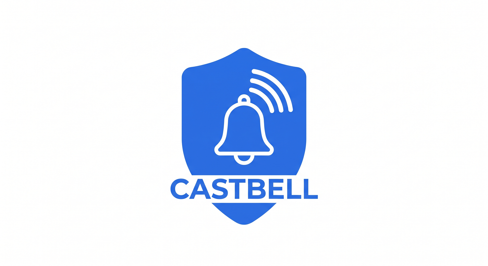

# castbell



A tiny webhook server that drives Chromecast / Google Nest devices when your
UniFi doorbell rings.

Receive an HTTP POST from your NVR or automation system (built for UniFi
Protect alarm webhooks), and castbell will, per device and in order:

- 🔔 play a doorbell chime (any reachable mp3, or a local file it serves itself)
- 📷 display the camera snapshot embedded in the webhook payload
- 📺 start a live video stream (TODO: needs testing)
- ▶️ resume whatever was playing before the doorbell interrupted it

Single static binary, ~16 MB Docker image, no runtime dependencies.

## Use case

You have a UniFi Protect doorbell and a couple of Nest Hubs / Chromecasts.
When someone rings, you want the kitchen display to chime, show who is at the
door for a few seconds, and then go back to the music or video it was playing —
and the hallway speaker to just chime. Point Protect's alarm webhook at
castbell and describe that behaviour on the command line. Done.

## How it works

```
doorbell ──> UniFi Protect ──POST alarm──> castbell ──cast──> kitchen Nest Hub
             alarm webhook    (JSON +           │               (chime, snapshot,
                              base64 JPEG)      └────cast──> hall speaker      resume)
                                                └────cast──> living room TV
```

1. You declare devices, endpoints and per-device action sequences via CLI flags.
2. A POST to a configured endpoint is validated and logged; unknown paths 404.
3. The base64 JPEG thumbnail in the payload is cached in memory and served at
   `/media/{id}` so the Chromecast can fetch it over your LAN (`--advertise-url`).
4. Each device's action list runs in order. `resume` re-launches the previous
   media app and continues the stream at its last position.

## UniFi Protect setup
castbell was built for [UniFi Protect](https://ui.com/camera-security). To wire
it up:

1. Open **UniFi Protect → Settings → Alarm Manager**.
2. Create a new alarm and add a **ring** event from your doorbell as the
   trigger.
3. Under actions, choose **Action Webhook** and paste your castbell endpoint
   URL into the **custom webhook** field, e.g.
   `http://192.168.1.2:8080/doorbell`.

Protect will now POST the alarm payload (including the base64 snapshot) to
castbell every time someone rings.

## Quick start (Docker)

```sh
docker build -t castbell .

docker run -ti -p 8080:8080 localhost/castbell \
  --device hall:192.168.1.201 \
  --device kitchen:192.168.1.202 \
  --endpoint /doorbell:hall,kitchen \
  --action hall:doorbell \
  --action kitchen:doorbell \
  --action kitchen:sleep:3s \
  --action kitchen:thumbnail:20s \
  --action kitchen:resume \
  --doorbell-url https://sound-effects-media.bbcrewind.co.uk/mp3/07042240.mp3 \
  --advertise-url http://192.168.1.2:8080 \
  --listen 0.0.0.0:8080
```

What the example does on each ring:

- **hall** (192.168.1.201): plays the chime.
- **kitchen** (192.168.1.202): plays the chime, waits 3 s, shows the doorbell
  snapshot for 20 s, then resumes whatever was playing before.

`--advertise-url` must be the address of the machine running the container **as
reachable from the Chromecasts** (they fetch the thumbnail/mp3 over HTTP).

Trigger it manually with curl:

```sh
curl -X POST http://192.168.1.2:8080/doorbell \
  -H 'Content-Type: application/json' \
  -d '{
        "alarm": {
          "name": "Ring - webhook",
          "triggers": [{ "key": "ring", "eventId": "evt-1" }],
          "thumbnail": "data:image/jpeg;base64,/9j/4AAQ..."
        },
        "timestamp": 1787498999168
      }'
```

## CLI reference

| Flag | Required | Description |
| --- | --- | --- |
| `--listen <addr>` | no (default `127.0.0.1:8080`) | Address the webhook server binds to. Use `0.0.0.0:8080` in Docker. |
| `--device <alias>:<ip>` | yes, repeatable | Chromecast/Nest device registry. |
| `--endpoint <path>:<alias,alias>` | yes, repeatable | Webhook paths (≥ 8 chars) routed to one or more device aliases. |
| `--action <alias>:<kind>` | no, repeatable | Ordered per-device action list (see below). |
| `--doorbell-url <url>` | for `doorbell` action | Remote mp3 the Chromecast fetches directly. |
| `--doorbell-file <path>` | for `doorbell` action | Local mp3 served at `/doorbell.mp3` via `--advertise-url`. Mutually exclusive with `--doorbell-url`. |
| `--livestream-url <url>` | for `livestream` action | Stream URL loaded by the `livestream` action. |
| `--advertise-url <url>` | for `thumbnail`/`doorbell-file` | Externally reachable base URL of this server. Must not be loopback. |

### Actions

| Action | Effect |
| --- | --- |
| `doorbell` | Play the chime (`--doorbell-url` or `--doorbell-file`). |
| `thumbnail` | Show the payload snapshot until the next load. |
| `thumbnail:<dur>` | Show the snapshot, auto-clear after `<dur>` (e.g. `thumbnail:20s`). |
| `livestream` | Play `--livestream-url`. |
| `sleep:<dur>` | Wait between loads (e.g. `sleep:3s`, `sleep:500ms`). |
| `resume` | Re-launch the previous media app and resume its stream at the last position. Must be the **last** action for a device. |

Actions run in the order given on the command line.

## Webhook API

- `POST <configured endpoint>` — UniFi Protect alarm payload (see curl above).
  The thumbnail is required only if a routed device has a `thumbnail` action.
  Event id is taken from `triggers[0].eventId`, falling back to
  `triggers[0].sourceEvent.id`.
- `GET /healthz` — liveness probe, always `200 ok`.
- `GET /media/{id}` — serves a cached thumbnail (used by the Chromecast).
- `GET /doorbell.mp3` — serves `--doorbell-file`, if configured.

Responses: `200 ok` · `400` malformed body/payload · `404` unknown endpoint ·
`500` one or more cast devices failed.

## Testing without a doorbell

The workspace ships `castbell-client`, a small CLI that builds and POSTs a
realistic Protect-style payload:

```sh
# print the payload
cargo run -p castbell-client -- --print

# send it (use --thumbnail path/to/photo.jpg for a real image)
cargo run -p castbell-client -- --url http://127.0.0.1:8080/doorbell --thumbnail snapshot.jpg
```

## Build from source

```sh
cargo build --release -p castbell   # binary in target/release/
cargo test                              # run the test suite
```

## Docker image

Multi-stage build: Rust musl target → fully static binary →
`gcr.io/distroless/static-debian12:nonroot` runtime (~2 MB base). Final image
is ~16 MB, runs as non-root, and has no shell, libc or OpenSSL in it.

Pre-built images are on GitHub Container Registry (amd64 + arm64):

```sh
docker pull ghcr.io/ramaro/castbell:latest
# or a pinned release, e.g v0.0.1 (see releases for latest pinned tag)
docker pull ghcr.io/ramaro/castbell:v0.0.1
```

## Disclaimer
This project was built with the assistance of AI tools. AI was used to help generate code, draft documentation and optimise implementation details.
All code was reviewed and tested prior to release.
